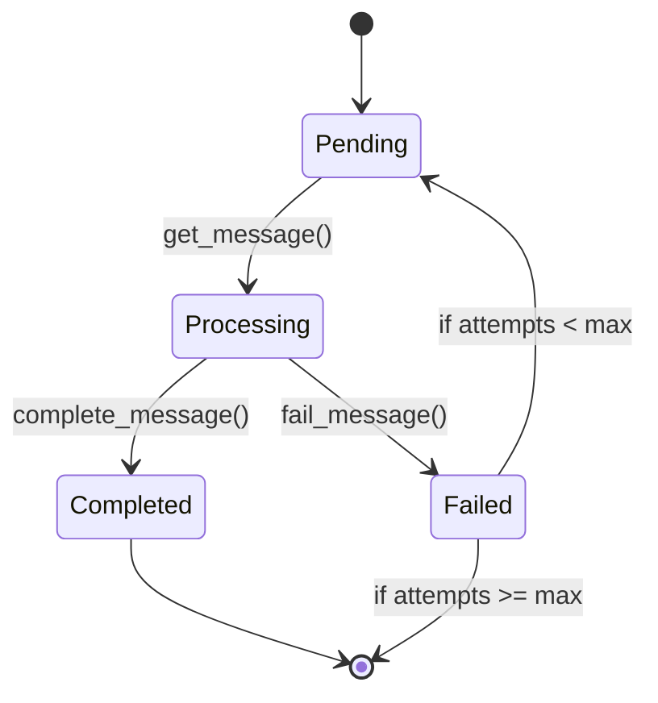

# MongoDB Message Queue - Python Implementation


A robust, production-ready message queue/service bus implementation using MongoDB as the backing store.

## Features

- ✅ **Channel-based Isolation** - Strict message separation by channels
- 🔢 **Guaranteed Ordering** - Atomic sequence numbers per channel
- 🔄 **Automatic Retries** - Configurable retry logic for failed operations
- 💓 **Heartbeat Monitoring** - Detects stalled consumers
- ⏱️ **Visibility Timeout** - Configurable processing time limits
- 📊 **Monitoring** - Channel statistics and detailed logging
- 🔒 **Thread-safe** - Safe for concurrent access

## Installation

```bash
pip install pymongo python-dotenv
```
## Configuration
```python
# MongoDB Connection
MONGO_URI=mongodb://localhost:27017
MONGO_DB_NAME=message_queue_db

# TLS/SSL (Optional)
# MONGO_TLS=true
# MONGO_CA_FILE=/path/to/ca.pem

# Queue Settings
MQ_MAX_RETRIES=3
MQ_RETRY_DELAY=1.0
MQ_VISIBILITY_TIMEOUT=300
MQ_HEARTBEAT_INTERVAL=30
MQ_MAX_ATTEMPTS=3
MQ_RETENTION_DAYS=7
```

## Basic Usage
```python
from mongodb_message_queue import MongoDBMessageQueue

# Initialize queue
with MongoDBMessageQueue() as queue:
    # Producer
    message_id = queue.publish_message("orders", {"order_id": 1001})
    
    # Consumer
    message = queue.get_message("orders", "worker_1")
    if message:
        try:
            process_message(message['payload'])
            queue.complete_message(message['_id'], "worker_1")
        except Exception:
            queue.fail_message(message['_id'], "worker_1")
    
    # Get stats
    stats = queue.get_channel_stats("orders")
    print(f"Pending messages: {stats['pending']}")
```
### Advanced Usage
Multi-worker Processing
```python
from threading import Thread
from mongodb_message_queue import MongoDBMessageQueue

def worker(worker_id):
    with MongoDBMessageQueue() as queue:
        while True:
            message = queue.get_message("jobs", worker_id, timeout=10)
            if message:
                try:
                    process_job(message['payload'])
                    queue.complete_message(message['_id'], worker_id)
                except Exception:
                    queue.fail_message(message['_id'], worker_id)

# Start 5 workers
for i in range(5):
    Thread(target=worker, args=(f"worker_{i}",)).start()
```
## Message Lifecycle


## API Reference
``` python
MongoDBMessageQueue
```
| Method | Description |
| -------- | -------- |
| publish_message(channel, payload)	 | Publish message to channel |
| get_message(channel, consumer_id)	 | Get next message (returns None if empty) |
| complete_message(message_id, consumer_id)	 | Mark message as completed |
| fail_message(message_id, consumer_id)	 | Mark message as failed |
| get_channel_stats(channel)	 | Returns message counts by status |
| close()		 | Clean up resources |

## Performance Tips
1. Batch Publishing: Group messages when possible
2. Optimal Visibility Timeout: Set based on your processing time
3. Monitor Statistics: Watch for channel backlogs
4. Proper Indexing: Already handled by the implementation

## Contributing
1. Fork the repository
2. Create your feature branch
3. Commit your changes
4. Push to the branch
5. Create a new Pull Request

## License
MIT License - See LICENSE for details.

## Future TO DO Implementations (Probable)
1. Enhanced Message Features

| Feature | Description | Benefit |
| -------- | -------- |-------- |
| Priority Queues | Add ```priority``` field to messages (0-9) with compound index on (```channel```, ```priority```, ```sequence_number```) | Handle high-priority messages first |
| Scheduled Messages | Implement ```deliver_after``` timestamp field with TTL index	 | Future-dated message delivery |
| Message Groups | Add ```group_id``` to sequence messages within logical groups | Ordered processing of related messages |
| Message Expiration | Add ```ttl_seconds``` field with server-side TTL index	| Auto-expire stale messages |

2. Scalability Improvements
| Feature | Description | Benefit |
| -------- | -------- |-------- |
| **Sharding**           | Shard collections by `channel`                   | Horizontal scaling for high throughput |
| **Batched Operations** | Add `bulk_publish()` and `bulk_complete()` methods | Reduce network roundtrips             |
| **Cursor-based Pagination** | Implement `get_messages(limit=100, last_id=None)` | Efficient bulk message retrieval      |
| **Read Preference**    | Configure secondary reads for stats/queries       | Reduce load on primary                |

3. Reliability Enhancements
| Feature | Description | Benefit |
| -------- | -------- |-------- |
| **Dead Letter Queue**       | Auto-move failed messages to `_dlq` channel      | Debug failed messages                 |
| **Poison Pill Detection**   | Track processing time, auto-fail slow messages   | Prevent consumer stalls               |
| **Transactional Operations**| Use MongoDB multi-document transactions          | Atomic multi-message ops              |
| **Exactly-Once Delivery**   | Add `idempotency_key` to messages                | Prevent duplicate processing          |

4. Monitoring & Observability
| Feature | Description | Benefit |
| -------- | -------- |-------- |
| **Prometheus Metrics** | Track queue depth, processing time, errors       | Real-time monitoring                  |
| **Admin API**          | Add REST endpoints for queue management          | Operational control                   |
| **Message Tracing**    | Add `trace_id` using OpenTelemetry               | Distributed tracing                   |
| **Slow Query Logging** | Log queries >100ms                               | Performance optimization              |

5. Advanced Consumer Patterns
| Feature | Description | Benefit |
| -------- | -------- |-------- |
| **Competing Consumers**| Auto-balancing worker pool                       | Horizontal scaling                    |
| **Pub/Sub**           | Multiple consumers per channel                   | Fan-out messaging                     |
| **Backpressure**      | Dynamic `get_message()` timeout based on queue depth | Auto-throttling                  |
| **Delayed Retries**   | Exponential backoff for failed messages          | Error handling                        |

6. Security Features
| Feature | Description | Benefit |
| -------- | -------- |-------- |
| **Channel ACLs**       | RBAC per channel                                 | Multi-tenant security                 |
| **Message Encryption** | Field-level encryption                           | Sensitive data protection             |
| **Audit Logging**      | Log all queue operations                         | Compliance                            |
| **JWT Validation**     | Verify producer/consumer tokens                  | Authentication                        |